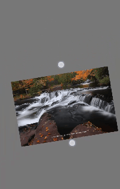

# YJIC
第一次公开发布一个小小的项目, 能力有限, 有BUG或建议可以在issues中提出   
## 介绍
js图片查看,缩放,移动,旋转;   
dome地址：[https://yyznm.gitee.io/yjic](https://yyznm.gitee.io/yjic)  

pc端根据鼠标位置缩放 等等等 ...  
  
手机上双指缩放旋转，一张动图解释一切   

  
## 软件架构
适配性 edge, Chrome ... 还有IE11(你没看错)  
就测试了这几个浏览器，其他的可以自己尝试  
dome地址：[https://yyznm.gitee.io/yjic](https://yyznm.gitee.io/yjic)  

## 安装教程

最简单用法
```html
<!-- 引入 -->
<script src="static/YJIC.min.js"></script>
<script>
    //直接传入img的URL
    YJIC.setData("img_url");
</script>
```

特殊用法

```js
// 设置并弹出图片, 动画真
YJIC.setData(dom, true);
// 弹出同时让原来的图片变透明
dom.style.opacity = 0
// 关闭回调，关闭后让图片显示
YJIC.setBackCallback(function(){
    dom.style.opacity = 1
});

//这样就有一种原来的图片被放大的感觉
```

## 使用说明

方法名 | 参数 | 用途
---|---|---
setData(data, follow) | data：图片的url 或者 img的dom;   follow：传入dom时, 是否有动画效果 | 设置并弹出图片
setStartZoom(z) | z：0 ~ 1 默认 1 | 初始图片相对浏览器的比例， 按长边算
setHintTime(t) | t：毫秒 默认 300 | 设置提示延时关闭的时间， 0就不提示
setBgc(color) | color：遮罩颜色 默认 rgba(0,0,0,.7) | 设置遮罩颜色 可以设置成 rgba(0,0,0,0) 透明
setDegIf(bool) | bool：默认 true | 设置手机两指是否可以旋转
setShadeClose(bool) | bool：默认 true |  设置点击遮罩是否关闭, 只在pc端有效 因为手机端背景用来监听了手势
setCloseIf(bool) | bool：默认 true | 设置右上角的关闭按钮是否显示
setHandleIf(bool) | bool：默认 true | 设置操作的按钮组是否显示
setBackCallback(call) | call：关闭的回调 | 设置关闭回调
setSizeCallback(call) | call：缩放时的回调  | 设置缩放时的回调
close() | 空 | 关闭
setAdd() | 空 | 加大
setSubtract() | 空 | 减小
rotateLeft() | 空 | 向左旋转
rotateRight() | 空 | 向右旋转


#### 特技

